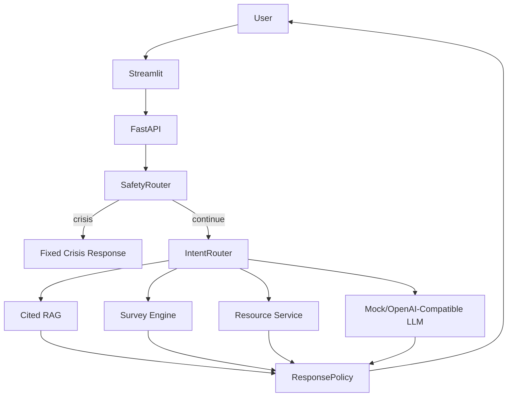

# Mental Health Information Support Assistant

心理健康信息支持助手：一个非诊断型 AI 应用 Demo，提供有来源的心理健康知识、自我了解问卷、专业支持路径和危机表达安全分流。

> 本项目不提供医学诊断、疾病概率、药物剂量、停药建议或治疗决定，也不声称经过临床验证或真实生产部署。

## Screenshot

当前仓库提供 Streamlit Demo。运行 `make run-ui` 后可在浏览器查看对话、问卷、资源和评估说明页面。

## Core Features

- FastAPI backend with `/health`, `/chat`, `/survey`, `/feedback` and Swagger `/docs`.
- MockLLM default mode, no API key required.
- Deterministic SafetyRouter for explicit crisis and medication-advice requests.
- IntentRouter for knowledge Q&A, survey, resources, supportive conversation and out-of-scope routing.
- Cited RAG answers from a small project-authored knowledge base.
- Config-driven survey with deterministic scoring.
- Streamlit demo with disclaimer, clear session, feedback and source-aware flows.
- SQLite feedback repository storing redacted comment preview and digest only.
- Legacy BERT isolated as optional disabled adapter, not a clinical model.

## Architecture



## Tech Stack

- Python 3.11+
- FastAPI, Pydantic v2
- Streamlit
- scikit-learn TF-IDF local retrieval backend for MVP
- SQLite for feedback
- pytest, ruff, mypy

## Local Start

```bash
python -m pip install -e ".[dev]"
make run-api
```

Open:

- API: http://localhost:8000
- Swagger/OpenAPI: http://localhost:8000/docs
- Health: http://localhost:8000/health

In another terminal:

```bash
make run-ui
```

## Mock Mode

Mock mode is the default:

```bash
LLM_PROVIDER=mock make run-api
```

No API key is required. This is the recommended mode for tests and demos.

## OpenAI-Compatible Mode

Copy `.env.example` to `.env` and set:

```env
LLM_PROVIDER=openai_compatible
OPENAI_API_KEY=...
OPENAI_BASE_URL=https://api.openai.com/v1
OPENAI_MODEL=gpt-4.1-mini
```

For DashScope-compatible mode, set `DASHSCOPE_API_KEY` and compatible base URL/model.

## Docker

```bash
docker compose up --build
```

Then open:

- Streamlit UI: http://localhost:8501
- API: http://localhost:8000
- Swagger/OpenAPI: http://localhost:8000/docs

If Docker Desktop BuildKit fails under a non-ASCII workspace path, use:

```powershell
$env:DOCKER_BUILDKIT='0'
$env:COMPOSE_DOCKER_CLI_BUILD='0'
docker compose up --build
```

## Data and Knowledge Sources

The v2 default knowledge base uses short project-authored summaries in `knowledge/sources/`. Legacy data is preserved under `legacy/` but is not used by default because source, license and privacy status are unclear.

## Safety Design

Safety is enforced in code, not only documentation:

- `SafetyRouter` catches explicit crisis and medication requests before normal chat.
- `ResponsePolicy` blocks diagnostic and medication-instruction patterns.
- Survey scoring is deterministic and non-diagnostic.
- Feedback persistence avoids full sensitive text storage.
- Tests cover crisis routing, diagnostic-claim blocking, medication blocking and survey constraints.

## Evaluation

Run:

```bash
make evaluate
pytest
```

Implemented evaluation scripts report actual results on small synthetic datasets:

- Intent: accuracy, macro F1, confusion matrix, per-class recall.
- RAG: retrieval hit rate, citation completeness, latency on 30 synthetic questions.
- Safety: crisis recall, non-crisis false positive rate, diagnostic and medication policy violations.

These are engineering regression checks, not clinical metrics.

## v1 to v2

- v1: monolithic CLI combining LangChain RAG, Qwen-compatible API and BERT risk-style classification.
- v2: layered non-diagnostic assistant with SafetyRouter, IntentRouter, cited retrieval, deterministic survey, MockLLM and tests.

## Interview Highlights

- Clear product boundary and safety requirements translated into code tests.
- Provider-neutral LLM interface with Mock mode for reliable demos.
- Separation of concerns across API, services, retrieval, survey, repositories and policy.
- BA-ready documentation: As-Is/To-Be flow, requirements, acceptance criteria and migration notes.

## Known Limits

- The retrieval backend is a lightweight MVP backend, not a production FAISS/Chroma deployment.
- Safety rules can over-trigger on academic/news mentions.
- No real location-aware hotline lookup is implemented.
- No clinical validation, real user metrics or production deployment claims are made.
