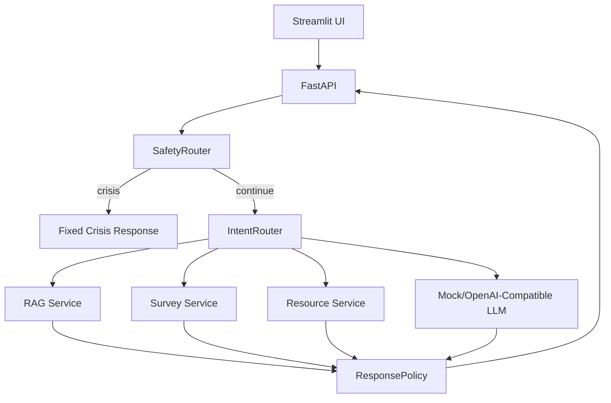

# Architecture

## Layers

- `app/api`: HTTP routes only.
- `app/services`: business orchestration, safety, intent, RAG, survey, resources and policy.
- `app/llm`: provider interface, MockLLM and OpenAI-compatible adapter.
- `app/retrieval`: manifest loading, splitting and local retrieval backend.
- `app/repositories`: current-session and feedback persistence.
- `ui`: Streamlit demo.
- `evaluation`: small reproducible evaluation scripts and datasets.

## Configuration

All model providers, keys and paths are read through `app/core/config.py`. Mock mode is the default.

## Retrieval Note

The MVP uses a deterministic local TF-IDF vector store for fast tests and demos. The retrieval interface is intentionally isolated so FAISS or Chroma can be swapped in later without changing API routes.

